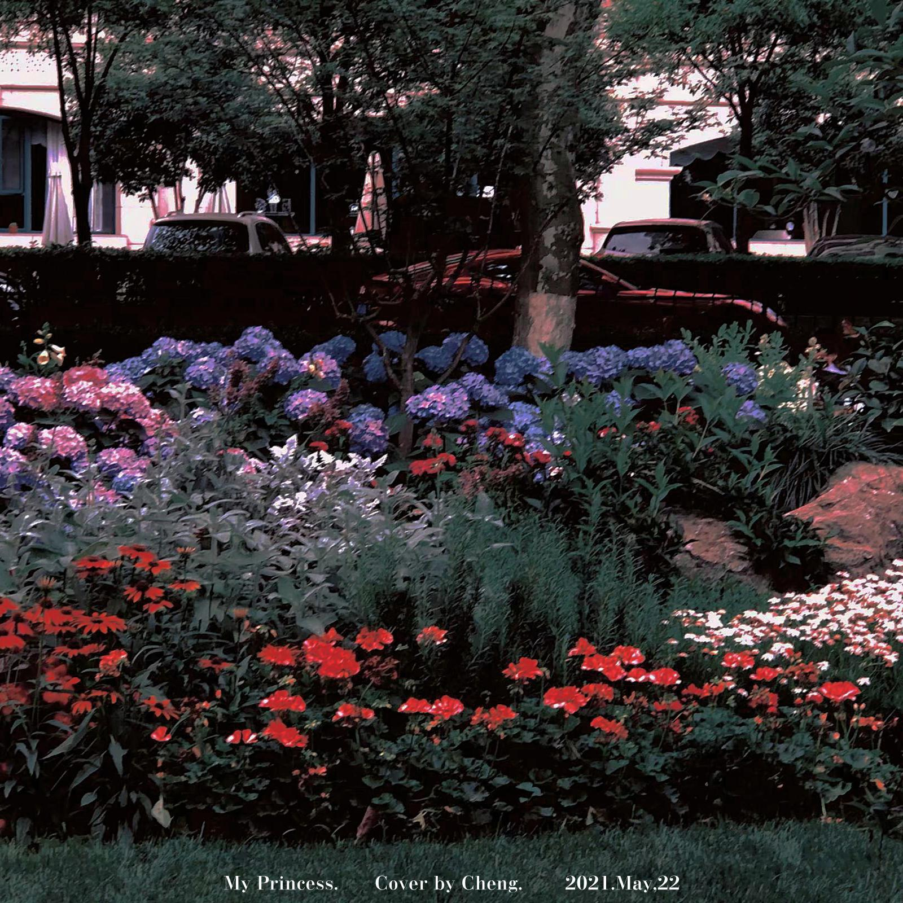

### 《#will u?》

#### 单曲简介/EP Info.

发行时间(Release Time): 2021-05-22 
所属专辑(In Album)：[#will u?](./tag.html?tag=%23will+u%3F) 
作曲(Composer): Hsiang Nianian 
简介(Intro.)： 
No intro yet.

#### 发布平台/Release Platform

1. Tencent Music
2. [Netease Music](https://music.163.com/#/song?id=1847160485)
3. [Spotify](https://open.spotify.com/track/1Aj964Rk83GqZzML83oRGT)
4. Soundcloud
5. and so on...

#### 试听/SoundCloud

<iframe width="100%" height="300" scrolling="no" frameborder="no" allow="autoplay" src="https://w.soundcloud.com/player/?url=https%3A//api.soundcloud.com/tracks/1448036281&color=%23ff5500&auto_play=false&hide_related=false&show_comments=true&show_user=true&show_reposts=false&show_teaser=true&visual=true"></iframe>
<a href="https://soundcloud.com/hsiang_nianian" title="简律纯" target="_blank" style="color: #cccccc; text-decoration: none;">简律纯</a> · <a href="https://soundcloud.com/hsiang_nianian/so-was-your-heart" title="So was your heart?" target="_blank" style="color: #cccccc; text-decoration: none;">So was your heart?</a>

<a>真的吗？</a>

