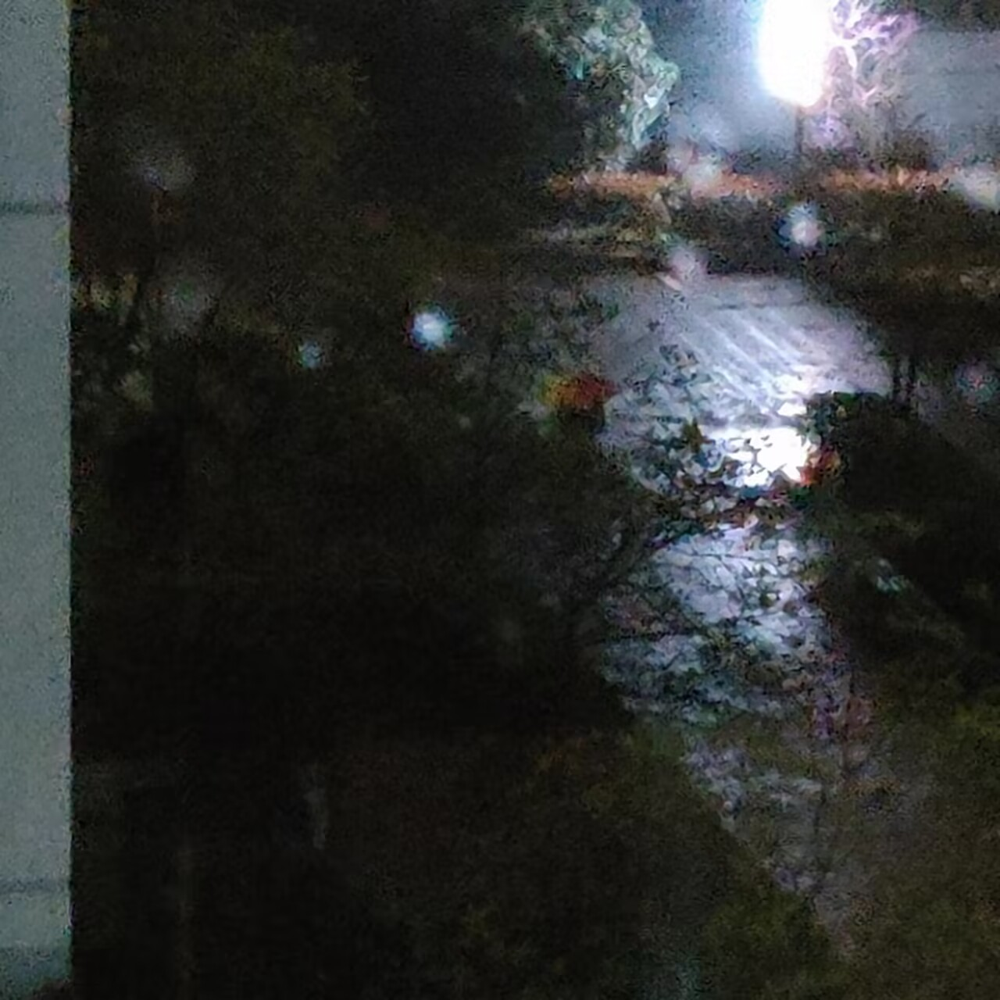

### 《sequel (余言后续)》

#### 专辑简介/Record Info.

发行时间(Release Time): 2023-04-29  
包含曲目(Including Disc.):  

|  #   |                                            name                                          |
| :==: | :======================================================================================: |
|   1  | [first encounter](https://open.spotify.com/track/1KKaZ0SWWAPvGEaZuijPc1)                 |
|   2  | [Vv(Beta1)](https://open.spotify.com/track/2WOGs6NKlAugwjFzzS3pmd)                       |
|   3  | [distinct or not (鲜明或者不鲜明)](https://open.spotify.com/track/6mIef3UhVMD6ng9e80VZzQ) |
|   4  | [what's your name](https://open.spotify.com/track/2MzSbptdobgIj24qqXeUat)                |
|   5  | [DATE](https://open.spotify.com/track/6q7WSZz9Ad2Bc7aTnzvSZr)                            |
|   6  | [game night in studio](https://open.spotify.com/track/6isO8KOv5d1lLf0S3ENxUc)            |
|   7  | [concise](https://open.spotify.com/track/2JkdqeANn80atqxwO9nvB1)                         |
  
作曲(Composer): Hsiang Nianian  
简介(Intro.):  
无。

#### 发布平台/Release Platform
1. Tencent Music
2. [Netease Music](https://music.163.com/#/album?id=164314726)
3. [Spotify](https://open.spotify.com/album/0yqx572tdDFsTgZTKjspK1)
4. Soundcloud
5. and so on...

#### 试听/Spotify

<iframe style="border-radius:12px" src="https://open.spotify.com/embed/album/0yqx572tdDFsTgZTKjspK1?utm_source=generator" width="100%" height="352" frameBorder="0" allowfullscreen="" allow="autoplay; clipboard-write; encrypted-media; fullscreen; picture-in-picture" loading="lazy"></iframe>

<a>喜欢吗？</a>

